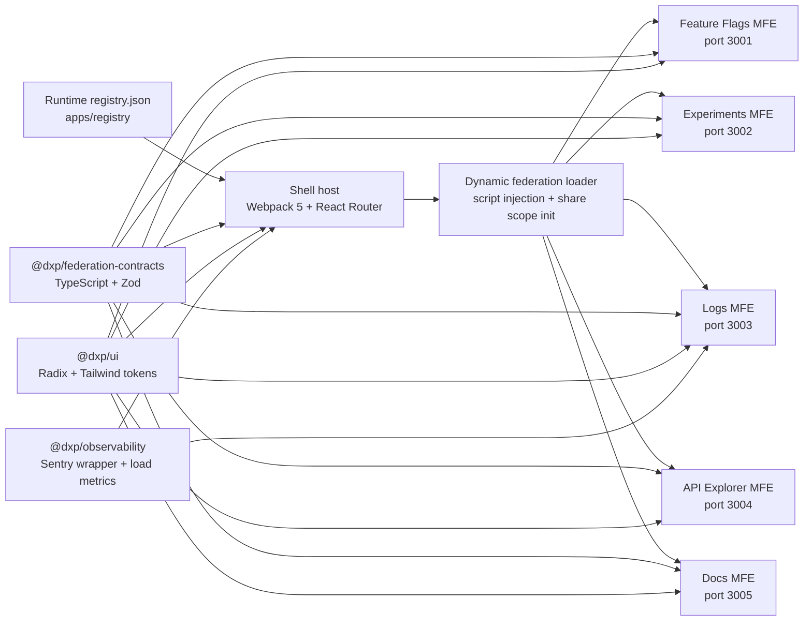

# Developer Experience Platform


DXP is a production-style Developer Experience Platform built to demonstrate how large engineering organizations compose independently owned frontend products into one governed internal platform.

It is not a single-page CRUD demo. It is a runtime-composed micro-frontend system with a Webpack 5 host shell, Rsbuild-powered remotes, a typed federation contract, registry-driven routing, RBAC, error isolation, observability hooks, shared design tokens, strict TypeScript, CI, and repeatable MFE scaffolding.

## Why This Project Matters

Modern platform teams win by setting strong boundaries: product teams need autonomy, while the platform needs reliability, security, design consistency, and operational visibility. This repo models that tradeoff.

- The shell owns platform concerns: authentication context, route orchestration, navigation chrome, RBAC, registry validation, remote loading, error boundaries, and telemetry.
- MFEs own product concerns: feature flags, experiments, logs, API exploration, and documentation.
- Shared packages define the contracts and primitives that keep the system coherent without coupling every team to every other team.
- CI and local hooks enforce the basics: lint, type-check, tests, build, import hygiene, accessibility rules, and strict TypeScript.

## System At A Glance



## What It Demonstrates

| Area                | Implementation                                                                                                   |
| ------------------- | ---------------------------------------------------------------------------------------------------------------- |
| Runtime composition | The shell has an intentionally empty `remotes` map and loads every MFE from `apps/registry/registry.json`.       |
| Team boundaries     | Each MFE exposes only `./App`, implemented as a `mount(container, props)` contract.                              |
| Contract safety     | `@dxp/federation-contracts` exports TypeScript interfaces and Zod schemas used by the shell and remotes.         |
| Resilience          | Remote loading has a 10 second timeout, retry behavior, script cleanup, per-MFE error boundaries, and retry UI.  |
| Access control      | Shell-level `ProtectedRoute` enforces registry permissions before mounting a remote.                             |
| Design consistency  | `@dxp/ui` provides reusable primitives and a shared Tailwind token preset.                                       |
| Observability       | MFE load performance is measured and forwarded through the Sentry wrapper package.                               |
| Developer velocity  | `tools/create-mfe` scaffolds a new remote with Rsbuild, Module Federation, tests, Tailwind, and contract wiring. |
| Quality gates       | Turborepo orchestrates lint, type-check, tests, and builds across apps and packages.                             |

## Product Surfaces

| App                      | Route                 | Ownership Story            | Highlights                                                                                                              |
| ------------------------ | --------------------- | -------------------------- | ----------------------------------------------------------------------------------------------------------------------- |
| `@dxp/shell`             | `/`                   | Platform host              | Runtime registry fetch, dynamic routing, RBAC, layout, global and per-MFE error boundaries.                             |
| `@dxp/mfe-feature-flags` | `/flags`              | Release engineering        | Flag list, environment toggles, admin-only delete, immutable keys, Zod-validated create/update flows.                   |
| `@dxp/mfe-experiments`   | `/experiments`        | Product experimentation    | Experiment lifecycle, variant allocation validation, Recharts conversion analysis, p-value significance display.        |
| `@dxp/mfe-logs`          | `/logs`               | Observability              | 10,000 synthetic log entries, debounced filtering, cursor pagination, TanStack Virtual rendering, detail dialog.        |
| `@dxp/mfe-api-explorer`  | `/api-explorer`       | Internal developer tooling | Method/path/header builder, Zod request validation, proxied request execution, response viewer, session-scoped history. |
| `@dxp/mfe-docs`          | `/docs`               | Internal docs              | Zod-validated nested docs manifest, Fuse.js search, Markdown/GFM rendering, docs navigation tree.                       |
| `@dxp/registry`          | `:4000/registry.json` | Platform config            | Source of truth for routes, scopes, remote URLs, versions, permissions, and enabled state.                              |

## Runtime Composition Flow

When a user navigates to an MFE route, the shell follows a platform-controlled sequence:

1. Fetch `registry.json` with `@dxp/registry-client`.
2. Validate the registry with `RegistrySchema` from `@dxp/federation-contracts`.
3. Filter navigation by `enabled` and `permissions`.
4. Inject the remote `remoteEntry.js` script at route activation time.
5. Initialize Webpack's default share scope.
6. Resolve `window[scope].get(module)`.
7. Validate the remote's default export with `MFEMountFnSchema`.
8. Mount the remote into an isolated container with auth, router, and theme context.
9. Track load duration and isolate failures with an MFE-specific error boundary.
10. Call `unmount()` on cleanup so React roots and theme state are released.

The shell can add, remove, disable, or retarget an MFE by changing registry config. No static remote import or shell route edit is required.

## Monorepo Layout

```text
.
+-- apps
|   +-- shell                 # Webpack 5 Module Federation host
|   +-- registry              # Runtime registry.json served on port 4000
|   +-- mfe-api-explorer      # API testing tool remote
|   +-- mfe-docs              # Searchable documentation remote
|   +-- mfe-experiments       # Experiment management remote
|   +-- mfe-feature-flags     # Feature flag management remote
|   +-- mfe-logs              # Virtualized log exploration remote
+-- packages
|   +-- auth-context          # AuthProvider, useAuth, mock users, JWT-shaped tokens
|   +-- federation-contracts  # Cross-team MFE manifest and mount contract
|   +-- observability         # Sentry initialization, error capture, load metrics
|   +-- registry-client       # Registry fetch, retry, cache fallback, React Query hook
|   +-- ui                    # Shared UI primitives, design tokens, Tailwind preset
|   +-- eslint-config         # Shared base/react/storybook lint config
|   +-- prettier-config       # Shared Prettier config
|   +-- tsconfig-base         # Strict TypeScript base config
+-- tools
    +-- create-mfe            # CLI for scaffolding new remotes
```

## Tech Stack

| Layer              | Technology                                               |
| ------------------ | -------------------------------------------------------- |
| Language           | TypeScript 5, strict mode, `moduleResolution: bundler`   |
| UI                 | React 18, React Router 6, Tailwind CSS                   |
| Host bundler       | Webpack 5 Module Federation                              |
| Remote bundler     | Rsbuild + `@module-federation/rsbuild-plugin`            |
| Server state       | TanStack Query                                           |
| Runtime validation | Zod                                                      |
| Design primitives  | Radix UI, class-variance-authority, shared DXP tokens    |
| Charts and search  | Recharts, Fuse.js                                        |
| Large lists        | TanStack Virtual                                         |
| Observability      | Sentry wrapper package                                   |
| Testing            | Vitest, React Testing Library, MSW where appropriate     |
| Tooling            | pnpm workspaces, Turborepo, ESLint 9, Prettier, Lefthook |

## Getting Started

### Requirements

- Node.js 20+
- pnpm 9+

### Install

```bash
pnpm install
```

### Run The Platform

```bash
pnpm dev
```

Open the shell at:

```text
http://localhost:3000
```

Local services use these ports:

| Service           | Port   |
| ----------------- | ------ |
| Shell             | `3000` |
| Feature Flags MFE | `3001` |
| Experiments MFE   | `3002` |
| Logs MFE          | `3003` |
| API Explorer MFE  | `3004` |
| Docs MFE          | `3005` |
| Registry          | `4000` |

If you want a smaller loop, run one workspace directly:

```bash
pnpm --filter @dxp/shell dev
pnpm --filter @dxp/mfe-feature-flags dev
pnpm --filter @dxp/registry dev
```

## Common Commands

| Command                                | What it does                                          |
| -------------------------------------- | ----------------------------------------------------- |
| `pnpm dev`                             | Starts all persistent dev servers through Turbo.      |
| `pnpm build`                           | Builds packages and applications in dependency order. |
| `pnpm test`                            | Runs all test suites.                                 |
| `pnpm lint`                            | Runs ESLint across workspaces.                        |
| `pnpm type-check`                      | Runs TypeScript checks across workspaces.             |
| `pnpm format`                          | Formats supported source, config, and Markdown files. |
| `pnpm create-mfe <name> --port <port>` | Scaffolds a new Module Federation remote.             |

## Creating A New MFE

```bash
pnpm create-mfe billing --port 3006
```

The scaffolded app includes:

- `rsbuild.config.ts` with Module Federation remote config.
- `src/mount.tsx` with the default `MFEMountFn` export.
- `src/App.tsx` using a fresh `QueryClient` per mount.
- `MemoryRouter` so the shell remains the URL owner.
- Tailwind config extending `@dxp/ui/tailwind`.
- Vitest config with 80% coverage thresholds.
- Mock `MFEProps` and test setup.

To integrate it into the shell, add a registry entry:

```json
{
  "name": "billing",
  "route": "/billing",
  "scope": "billing",
  "module": "./App",
  "url": "http://localhost:3006/remoteEntry.js",
  "permissions": ["admin", "dev"],
  "enabled": true,
  "version": "0.1.0",
  "canaryPercent": 0
}
```

## Quality Bar

This repo is intentionally strict because distributed frontends fail at boundaries.

- TypeScript enables `strict`, `noUncheckedIndexedAccess`, `exactOptionalPropertyTypes`, `noImplicitReturns`, and `isolatedModules`.
- ESLint rejects `any`, non-null assertions, import cycles, duplicate imports, and common React/accessibility issues.
- MFE test configs enforce 80% coverage thresholds for lines, functions, branches, and statements.
- Each MFE includes a mount contract test so the shell can trust the remote boundary.
- Registry and domain schemas are Zod-validated before data is trusted.
- CI runs install, lint, type-check, tests, and build on pushes and pull requests to `main` and `dev`.
- Lefthook runs formatting/linting before commit and type-check/tests before push.

## Environment Variables

| Variable       | Default                               | Purpose                                    |
| -------------- | ------------------------------------- | ------------------------------------------ |
| `REGISTRY_URL` | `http://localhost:4000/registry.json` | Registry endpoint used by the shell.       |
| `SENTRY_DSN`   | empty                                 | Enables Sentry reporting when provided.    |
| `APP_ENV`      | `development`                         | Runtime environment label.                 |
| `APP_VERSION`  | `0.0.0`                               | Version label attached to the shell build. |

## Reviewer Notes

This project is designed to make senior engineering judgment visible:

- It separates platform ownership from product ownership.
- It treats runtime JSON, remote exports, storage, and forms as untrusted inputs.
- It makes failure local instead of letting one remote take down the whole shell.
- It avoids shared global MFE state by giving each remote an isolated router and query cache.
- It encodes repeatability with scaffolding instead of relying on tribal knowledge.
- It shows practical tradeoffs: runtime federation for independent delivery, shared packages for consistency, and schema validation at every boundary.

## Current Roadmap

- Add visual documentation for `@dxp/ui` components.
- Expand end-to-end coverage around federation loading, RBAC, and API Explorer token safety.
- Implement canary routing behavior for the modeled `canaryPercent` registry field.
- Add generated architecture screenshots or a short demo recording for portfolio presentation.
